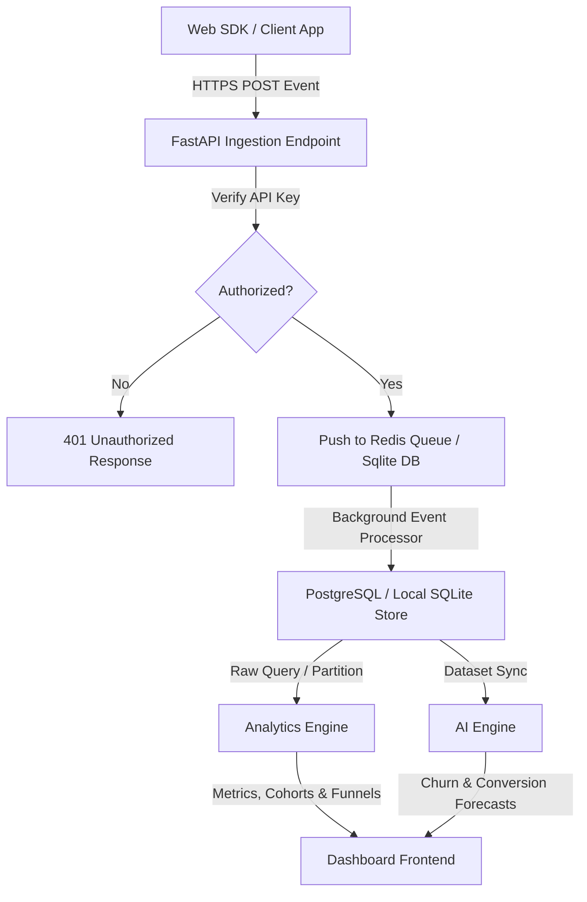

# Product Requirements Document (PRD)
## Project: InsightX – AI Product Analytics Platform

### 1. Document Version Control & Metadata
*   **Version**: 1.0.0 (MVP)
*   **Author**: Lead Product Manager (Antigravity AI)
*   **Target Release**: Q3 2026

### 2. Product Objectives & Target Audience
*   **Problem Statement**: Current analytics tools are descriptive but leave PMs and growth teams guessing "why" user conversions drop or "which" users will churn.
*   **Solution**: InsightX tracks and stores user behaviors and provides automated, diagnostic AI tools directly on top of the event graphs.
*   **User Personas**: Product Managers (decision-making), Growth Marketers (optimization), Developers (SDK setup).

### 3. System Architecture & Flowchart
The following Mermaid flow diagram outlines the telemetry stream logic of the InsightX event engine:

### 4. Functional Specifications (By Module)

#### Module 1: Authentication & Org Management
*   Secure signup/login using JSON Web Tokens (JWT) for authentication.
*   Workspace creation, allowing users to invite team members and toggle permissions (Admin, Editor, Viewer).
*   API key rotation for project data ingestion.

#### Module 2: SDK Event Tracking
*   SDK initialization script: `InsightX.init("API_KEY")`.
*   Tracking standard events: `InsightX.track("eventName", { properties })`.
*   System automatically captures device type, browser model, operating system, session identifier, and geo-location (IP lookup).

#### Module 3: Live Dashboard & Real-Time Stream
*   Real-time event feed that dynamically updates as users trigger tracking calls.
*   KPI summary metrics:
    $$\text{Stickiness} = \frac{\text{Daily Active Users (DAU)}}{\text{Monthly Active Users (MAU)}}$$
*   Interactive chart layouts for active user sessions over time, browsers, platforms, and geographies.

#### Module 4: Funnel Analysis
*   Allows the building of custom funnels (e.g., Landing $\rightarrow$ Register $\rightarrow$ Verify $\rightarrow$ Checkout).
*   For each step, compute:
    *   **Completion Rate**: \% of users who completed the current step from the start of the funnel.
    *   **Drop-off Rate**: \% of users who abandoned at this specific step.

#### Module 5: Retention Cohorts
*   Calculates classic N-day retention matrix showing user cohorts grouped by their acquisition date (week or month) and their corresponding activity rate on subsequent days (Day 1, Day 7, Day 14, Day 30).
*   **Formula**:
    $$\text{Retention Rate (Day } t\text{)} = \frac{\text{Users active on Day } t \text{ who were acquired on Day 0}}{\text{Total users acquired on Day 0}} \times 100\%$$

#### Module 6: A/B Testing & Feature Flags
*   Enables feature flags with custom percentage rollouts (e.g., flag enabled for $20\%$ of users based on hashing their `userId`).
*   A/B test statistical analysis calculating the p-value:
    $$Z = \frac{p_B - p_A}{\sqrt{p_p(1 - p_p)(\frac{1}{N_A} + \frac{1}{N_B})}}$$
    where $p_p$ is the pooled conversion rate. Determine whether the conversion difference is statistically significant (confidence $> 95\%$).

#### Module 7: AI Engine & Insights
*   **Churn Prediction**: Classify active users into "High Risk", "Moderate Risk", or "Healthy" based on interaction frequency and time elapsed since their last login.
*   **Revenue Forecasting**: Time-series extrapolation to predict monthly recurring revenue (MRR) for subsequent periods.
*   **Root Cause Analysis**: Dynamic text summaries suggesting why metrics fluctuate (e.g., "Checkout drop increased on Safari Mobile due to an unresolved JS syntax error on the shipping form").

---

### 5. Event Data Schema

#### `events` Table Schema
| Column Name | Data Type | Constraints | Description |
| :--- | :--- | :--- | :--- |
| `id` | VARCHAR(64) | Primary Key | Unique UUID representing the event |
| `project_id` | VARCHAR(64) | Foreign Key | Links to `projects.id` |
| `event_name` | VARCHAR(128)| NOT NULL | e.g. "Login", "Purchase" |
| `user_id` | VARCHAR(128)| NOT NULL | Identifies the unique client user |
| `session_id` | VARCHAR(128)| NOT NULL | Group events within a single session |
| `timestamp` | DATETIME | DEFAULT CURRENT_TIMESTAMP | Precise UTC execution time |
| `properties` | JSON / TEXT | - | Key-value properties (e.g. price, browser) |

---

### 6. Non-Functional Requirements
*   **Performance**: Ingestion latency under 50ms per event. Analytics dashboards must load results in under 500ms for datasets containing up to 1 million event logs.
*   **Security**: HTTPS transport protocol for all API communications. JWT tokens stored securely.
*   **Scalability**: Architecture must support easy migration from SQLite to click-optimized analytical stores like ClickHouse or Amazon Redshift.
